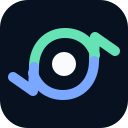

<p align="center">
  
</p>

<h1 align="center">Goal Loop</h1>

<p align="center">
  <em>A shell check, not agent prose, decides when the work is done.</em>
</p>

<p align="center">
  
  
  
  
  
</p>

---

Goal Loop is a small Cursor plugin and portable loop pattern. It gives your agent a `/goal` command that keeps working until a shell check passes.

The product is intentionally small:

- One main command: `/goal`
- One project-local contract: `.cursor/goal/active.json`
- One stop-hook loop that reruns your check after each finished turn
- One rule that matters: a command exit code decides when the work is done, not the agent's own claim

Use it when you want an agent to keep going until `npm test`, `npm run build`, a smoke script, or another concrete command passes. Do not use it as a broad agent platform, a planning OS, or a marketplace of agent behaviors. That is outside what this project does.

## Commands

| Command | Purpose |
|---------|---------|
| `/goal <objective>` | Start an active check-backed goal loop. |
| `/plan [objective]` | Draft objective and check before activation. |
| `/goal-status` | Read the active goal and last check result. |
| `/goal-abort` | Mark the active goal aborted, or remove it with `--remove`. |
| `/goal-pause` | Pause the active goal; hook skips the check until resumed. |
| `/goal-resume` | Resume a paused goal. |

## How it works

Goal Loop turns a normal objective into a bounded loop:

1. `/goal` writes a contract to `.cursor/goal/active.json`.
2. The agent works on that objective.
3. Cursor runs the Goal Loop stop hook after each finished turn.
4. The hook runs your check commands in the shell.
5. If a check fails, the hook returns a `followup_message` with the failure context and log path.
6. If every check passes, the hook marks the goal `completed` and returns `{}`.

That is the whole product.

It does not invent new agent thinking. It does not prove more than your check covers. It does not replace good scoping, good tests, or your own judgment.

## Install

The most effort Goal Loop will ever ask of you:

### Cursor

```text
/add-plugin goal-loop
```

After marketplace publication. For local development with Cursor Agent CLI:

```bash
cursor-agent --plugin-dir "$PWD" --workspace /path/to/your/project
```

### Claude Code

```bash
claude plugin install @bodecloud/goal-loop
```

Or use Git hooks directly: copy `hooks/hooks-claude.json` into `~/.claude/hooks.json` and `hooks/goal-stop-claude.sh` into your PATH. Goal Loop reads `.cursor/goal/active.json` from the project root, the same file Cursor uses, so the loop state is portable across hosts.

### OpenClaw

```bash
clawhub install goal-loop
```

Installs Goal Loop as an OpenClaw skill from ClawHub. OpenClaw applies it on coding tasks and exposes the `/goal` commands. Without ClawHub, copy `.openclaw/skills/` into `~/.openclaw/skills/`.

### Codex

```bash
codex plugin install @bodecloud/goal-loop
```

Goal Loop uses the same `.cursor/goal/` state files that Cursor uses, so the contract is portable across editors and CLI agents.

### Gemini CLI

```bash
gemini extensions install https://github.com/bodecloud/goal-loop
```

Loads the ruleset as always-on context every session. The `skills/` ship too when a task needs them.

### Qoder

Qoder auto-loads `AGENTS.md` from the repo root as always-on context, so running Goal Loop from a checkout works with zero setup. For per-project rules, copy `.qoder/rules/goal-loop.md` into your project's `.qoder/rules/`.

### Copilot CLI / VS Code

Copy `AGENTS.md` into your project root. For the CLI, copy `.github/copilot-instructions.md` into your project. The stop-hook adapter (`hooks/goal-stop-claude.sh`) works for Claude Code, Grok, and Copilot CLI.

Which files map to which agent: [Adapting Goal Loop to other agents](docs/other-agents.md).

## Uninstall

| Host | Command |
|------|---------|
| Cursor | Remove the plugin from Cursor settings |
| Claude Code | `claude plugin remove goal-loop` |
| OpenClaw | `clawhub uninstall goal-loop` |
| Cursor / Codex / Qoder / Copilot / Gemini | Delete the copied rule file |

These remove the plugin's own files. They leave behind project-local state in `.cursor/goal/`. To clean that up:

```bash
rm -rf .cursor/goal/active.json .cursor/goal/draft.json .cursor/goal/runs/
```

## Development

When changing the shared ruleset, keep the agent copies aligned:

```bash
node scripts/check-rule-copies.js
npm test
```

The OpenClaw skill package (`.openclaw/skills/`) is generated from `skills/`; rerun `node scripts/build-openclaw-skills.js` after changing a skill, the test suite fails if it is stale. To publish the skills to ClawHub, run `clawhub login` once, then `node scripts/publish-openclaw-skills.js` (it publishes all skills at the `package.json` version; pass `--dry-run` to preview).

## FAQ

**Can I use Goal Loop with other agents?**
Yes. The core pattern is portable: keep goal state in a project-local JSON file, run a check after each finished turn, continue only when that check fails, and stop when it passes. See [Adapting Goal Loop to other agents](docs/other-agents.md).

**What check should I use?**
`npm test`, `npm run build`, or any other shell command whose exit code decides pass or fail. Good checks are repeatable, local to the stated objective, cheap enough to rerun every turn, and strong enough to prove the intended result. See [How to design a check](docs/verifier-design.md).

**What happens if the hook crashes?**
Goal Loop fails open: a crashed hook returns `{}` (stop, no continuation) instead of trapping the agent in a loop. The error is written to `.cursor/goal/runs/hook-errors.log`.

**Does Goal Loop work offline?**
Yes. All checks run locally via the shell. No network calls are required for the core loop.

## License

[MIT](LICENSE).